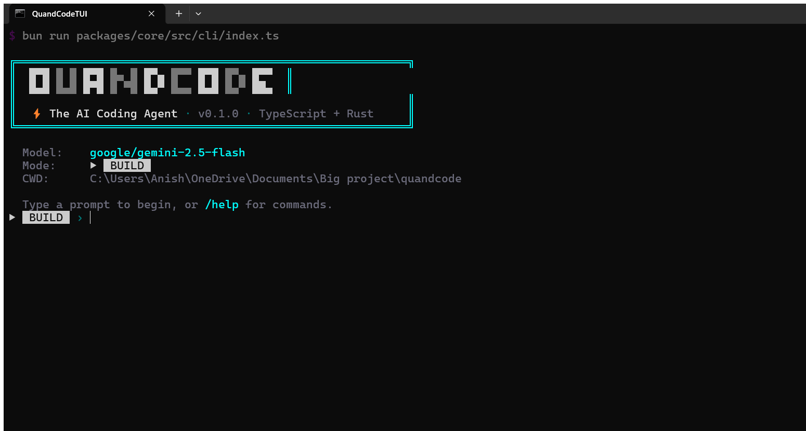

<p align="center">
  <h1 align="center">⚡ QuandCode</h1>
  <p align="center"><strong>The AI Coding Agent</strong></p>
  <p align="center">
    <em>TypeScript + Rust · 75+ LLM Providers · Plan/Build Dual Agents · Cyber TUI</em>
  </p>
</p>

<p align="center">
  
  
  
  
  
</p>

<p align="center">
  
</p>

---

## ✨ Features

- **75+ LLM Providers** — OpenAI, Anthropic, Google, Mistral, Ollama, OpenRouter, and many more via a unified provider abstraction
- **Plan / Build Dual Agents** — A planning agent reasons about architecture and strategy; a build agent executes code changes with precision
- **LSP Integration** — Real-time diagnostics, type checking, and code intelligence from language servers for TypeScript, Python, Rust, Go, and more
- **Cyber TUI** — A dynamic terminal interface with animated panels, streaming markdown, and a cyberpunk aesthetic
- **Rust Sandbox** — Secure file I/O and command execution via a Rust-powered subprocess sandbox
- **Tool System** — Extensible tool framework including file read/write/edit, bash execution, glob search, grep, and LSP diagnostics
- **Session Continuity** — SQLite-backed conversation storage with resume, branch, and context-window management
- **Configuration as Code** — `quandcode.json` with Zod-validated schemas, per-project and global config, permission levels for every tool

---

## 🚀 Installation

```bash
# Clone the repository
git clone https://github.com/your-org/quandcode.git
cd quandcode

# Install dependencies with Bun
bun install
```

> **Prerequisites:** [Bun](https://bun.sh) v1.3+ and [Rust](https://rustup.rs) (for the sandbox, Phase 10).

---

## ⚡ Quick Start

```bash
# Run the CLI
bun run quandcode

# Start a coding session with a prompt
bun run quandcode run -p "Refactor the auth module to use JWT"

# Initialize QuandCode in a project
cd your-project
bun run quandcode init

# List available models
bun run quandcode models
```

---

## 🏗️ Architecture

QuandCode is built as a modular monorepo with a 12-phase architecture:

| Phase | Component | Description |
|-------|-----------|-------------|
| 1 | **Monorepo Foundation** | Bun workspaces, TypeScript config, project scaffolding |
| 2 | **Storage Layer** | SQLite via `bun:sqlite` for sessions, config, and context |
| 3 | **Session Manager** | Conversation tracking, context windows, branch/resume |
| 4 | **Provider Abstraction** | Unified LLM interface for 75+ providers |
| 5 | **Message Pipeline** | Streaming, tool-call parsing, prompt assembly |
| 6 | **Tool System** | File ops, bash, glob, grep, LSP diagnostics |
| 7 | **Permission Guard** | Allow / ask / deny permissions per tool |
| 8 | **Agent Loop** | Plan + Build dual-agent orchestration |
| 9 | **LSP Client** | Language server protocol integration |
| 10 | **Rust Sandbox** | Secure subprocess execution via Rust |
| 11 | **Cyber TUI** | Dynamic terminal UI with panels and animations |
| 12 | **Polish & Ship** | Testing, packaging, documentation |

```
quandcode/
├── packages/
│   ├── core/          # CLI, config, storage, providers, tools, agents
│   ├── tui/           # Cyber terminal interface
│   └── sandbox/       # Rust-based secure execution (Phase 10)
├── package.json       # Bun workspace root
├── tsconfig.json      # Shared TypeScript config
└── README.md
```

---

## 🛠️ Development

```bash
# Run all packages in dev mode
bun run dev

# Type-check the entire project
bun run typecheck

# Build all packages
bun run build
```

---

## 📄 License

[MIT](LICENSE) — Built with ⚡ by the QuandCode contributors.
